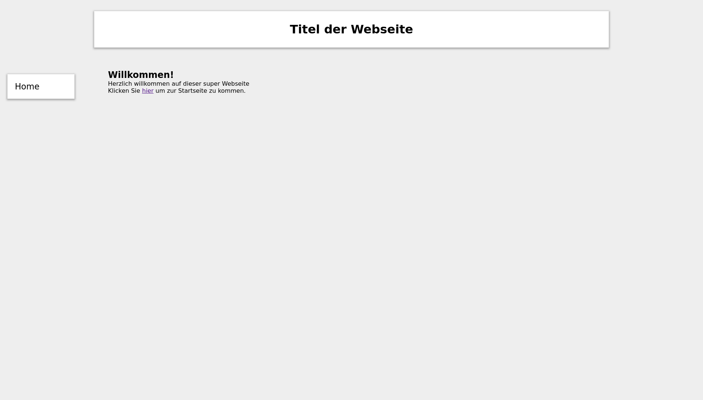

# Test Exam

## Exercise 1 (Fork the Repo - 1 P.)

Fork the repository into your own github account.

## Exercise 2 (Some Styling - 3 P.)

Change the `main.css` to match the following image

## Exercise 3 (Write a Webscraper - 4 P.)

1. Go to the website 'https://www.w3schools.com/cssref/css_selectors.asp' and
   inspect the table elements. Which HTML/CSS tags do they have?
2. The middle entry in the table has a CSS class. What is it called?
3. Open the file `scrape.py` and read through the code.
3. Run the code and compare the newly created file `selectors.json` with the
   table on the website. What do you observe?
4. Organize the code into three functions as defined in `run.py`:
   `my_scraper()` should run the webscraping code and return `table_rows`;
   `my_filter()` should apply your filter function (for now this can be the
   empty filter as shown) and return `table_rows`; `write_json()` should take
   over the task of writing the output to the json file.
5. Delete `selectors.json` and run all three programs in `scrape.py`; if
   everything works out you should see that file reappear. Copy the three
   functions to the `run.py` file. Make sure any required modules are loaded at
   the beginning.

## Exercise 4 (Integrating into Your Website - 4 P.)

1. Add a page called `scraping.html` to your website that extends `base.html`.
1. Add a button (link) to this page that runs the webscraping function in the
   background (i.e. on  clicking the link the function my_scraper() is
   executed). You can test this by deleting the file `selectors.json` and
   clicking the link. The file should be recreated.

## Exericse 5 (Displaying your Results - 4 P.)

1. Create a new page `results.html` that extends `base.html` and displays the
   results from the webscraping.
1. Play around with the display. Perhaps use `choice` to show a random
   selector, or create a table that shows all results in your own style.

## Exericse 6 (Pull Request - 1 P.)

Create a pull request to upstream.

## Exercise 7 (Bonus 1: Create a new Design - 2 P.)

Create a new branch an implement an alternative design. Create another pull
request from this new branch.

## Exercise 8 (Bonus 2: Filtering - 3 P.)
Implement a filter function on your scraping results that only return selectors
which contain a single `:`. When finished create another pull request.
